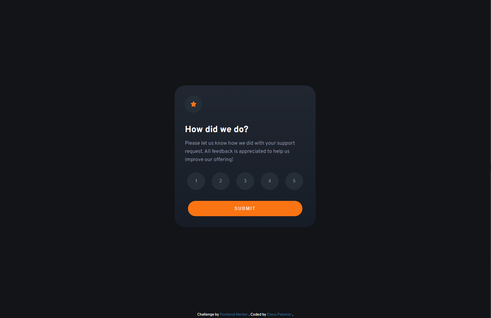
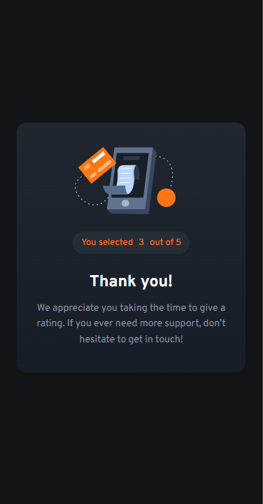

# Frontend Mentor - Product preview card component solution

## Welcome! 👋

Thanks for checking out this front-end coding challenge.
This is a solution to the [Interactive rating component challenge on Frontend Mentor](https://www.frontendmentor.io/challenges/interactive-rating-component-koxpeBUmI). Frontend Mentor challenges help you improve your coding skills by building realistic projects.

## Table of contents

- [Overview](#overview)
  - [The challenge](#the-challenge)
  - [Screenshot](#screenshot)
  - [Links](#links)
- [Built with](#built-with)
- [Author](#author)

## Overview

### The challenge

You should be able to:

- View the optimal layout for the app depending on their device's screen size
- See hover states for all interactive elements on the page
- Select and submit a number rating
- See the "Thank you" card state after submitting a rating

### Screenshot

  

  

### Links

- [Solution URL](https://github.com/ElenaPalomar/interactive-rating)
- [Live Site URL](https://elenapalomar.github.io/interactive-rating/)

## My process

### Built with

- Semantic HTML5 markup
- CSS custom properties
- Flexbox
- Mobile-first workflow
- JavaScript

## Author

- Frontend Mentor - [@ElenaPalomar](https://www.frontendmentor.io/profile/ElenaPalomar)
- GitHub - [ElenaPalomar](https://github.com/search?q=ElenaPalomar)
